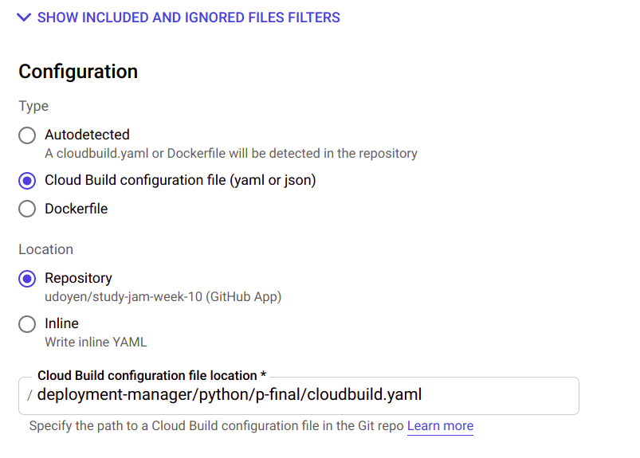

# Studyjam Project Deployment Using GCP Deployment Manager

Overall workflow:

- Create gcp cluster using deployment manager
- Create deployment, and expose services (NodePort, Ingress) using cloud build triggers
- Project folder: **projects/deployment-manager/python/p-final**

## Steps

1. Create a gcp account if you don't have one and enable the needed APIs
2. Clone the repository
3. Create a cloud build trigger using to image below as a guide on how to target the build file:

      
      
4. Add your own image in the **cloudbuild.yaml** file
5. Create small change and push or trigger from the cloud build console
